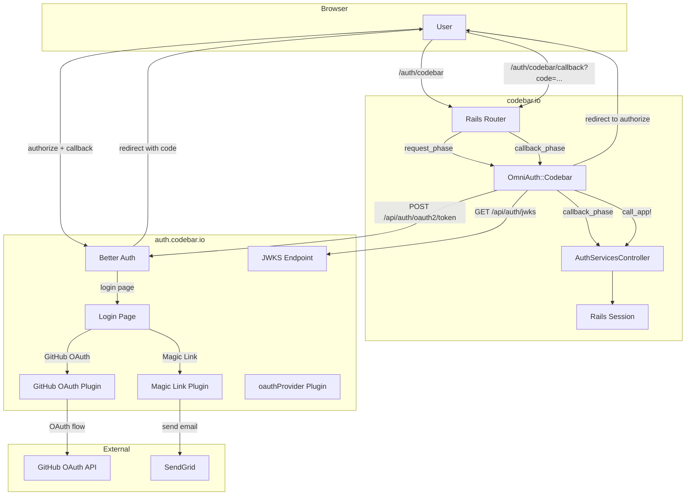
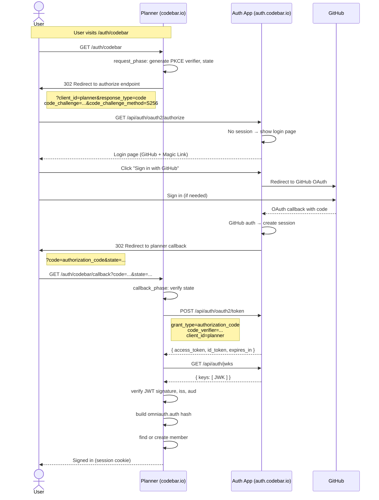
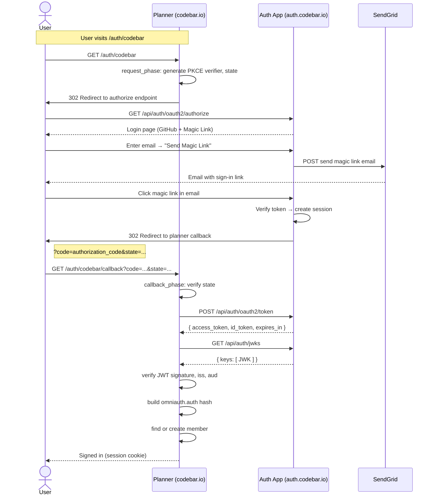

# Architecture

How the auth app and planner app work together to authenticate users.

## Overview

The auth app (`auth.codebar.io`) is an OAuth 2.1 / OIDC provider built with
[Better Auth](https://better-auth.com). It serves login, profile, and logout
pages, and delegates application authentication to the **planner app**
(`codebar.io`) which delegates to the auth app via a custom OmniAuth strategy.

```
┌─────────────────────┐    OAuth 2.1 + OIDC     ┌─────────────────────┐
│   Planner App       │◄───────────────────────►│   Auth App          │
│   (codebar.io)      │   authorization code    │   (auth.codebar.io) │
│                     │   PKCE                  │                     │
│   OmniAuth::Codebar │   token exchange        │   Better Auth       │
│   Rails session     │   JWKS verification     │   oauthProvider     │
│                     │                         │   GitHub OAuth      │
│                     │                         │   Magic Link        │
└─────────────────────┘                         └─────────────────────┘
```

The auth app offers two ways to authenticate:

- **GitHub OAuth** — user signs in with their GitHub account
- **Magic Link** — user enters their email and receives a one-time sign-in link

Both follow the same outer OAuth 2.1 flow. They differ only in how the user
authenticates on the auth app's login page.

## Architecture Diagram



## Flow A: GitHub OAuth

The user clicks "Sign in with codebar" on the planner, authenticates via GitHub
on the auth app, and gets redirected back.



## Flow B: Magic Link

The user clicks "Sign in with codebar", enters their email on the auth app,
clicks the magic link, and completes the OAuth flow.



The flows converge at the token exchange. The only difference is how the user
authenticates on the auth app.

## Key Components

### Auth App (`codebar/auth`)

- **Better Auth** instance with plugins: `jwt`, `oauthProvider`, `magicLink`,
  `admin`
- **oauthProvider plugin** — issues OAuth 2.1 authorization codes and tokens.
  Configured with PKCE required, `planner` as the only valid audience, and
  `allowDynamicClientRegistration: false`.
- **Login page** (`/login`) — offers "Sign in with GitHub" and "Send Magic
  Link" options, served during the OAuth authorize phase when no session
  exists.
- **JWKS endpoint** (`/api/auth/jwks`) — serves public keys for JWT signature
  verification, fetched and cached by the planner.
- **Seed client** (`src/app/db/seed-client.js`) — registers the `planner`
  OAuth client in the database via raw SQL. Runs during every deploy (release
  phase) for idempotency.

### Planner App (`codebar/planner`)

- **OmniAuth custom strategy** (`lib/omniauth/strategies/codebar.rb`)
  — implements the OAuth 2.1 client with PKCE:
  - **Request phase** — redirects to the auth app's authorize endpoint with
    PKCE challenge, state, and OIDC scopes
  - **Callback phase** — verifies state, exchanges the code for tokens,
    verifies the JWT against JWKS, builds the `omniauth.auth` hash
- **Route** (`/auth/codebar`) — triggers the OmniAuth request phase
- **Route** (`/auth/codebar/callback`) — triggers the callback phase, which
  calls `call_app!` → `AuthServicesController#create`
- **Controller** (`app/controllers/auth_services_controller.rb`) — creates or
  finds a `Member` and establishes a Rails session

## Environment Layout

| App                  | Domain                          | Heroku App                                        |
| -------------------- | ------------------------------- | ------------------------------------------------- |
| Auth (production)    | `auth.codebar.io`               | `codebar-auth-production`                         |
| Planner (production) | `codebar.io`                    | `codebar-auth-production` (branch: `heroku/main`) |
| Planner (staging)    | `codebar-staging.herokuapp.com` | `codebar-staging`                                 |

There is no staging auth app. Auth changes are deployed directly to production
via the `heroku/main` branch.

### Environment Variables

**Auth app:**

| Variable                | Purpose                                               |
| ----------------------- | ----------------------------------------------------- |
| `DATABASE_URL`          | PostgreSQL connection string                          |
| `GITHUB_CLIENT_ID`      | GitHub OAuth app client ID                            |
| `GITHUB_CLIENT_SECRET`  | GitHub OAuth app client secret                        |
| `SENDGRID_API_KEY`      | API key for magic link email delivery                 |
| `PLANNER_REDIRECT_URIS` | Comma-separated list of allowed callback URIs         |
| `CODEBAR_AUTH_URL`      | Self-referential base URL (`https://auth.codebar.io`) |

**Planner app:**

| Variable           | Purpose                                       |
| ------------------ | --------------------------------------------- |
| `CODEBAR_AUTH_URL` | Auth app base URL (`https://auth.codebar.io`) |
| `CODEBAR_AUDIENCE` | JWT audience (`planner`)                      |

## Operational Details

### OAuth Client Seeding

The `planner` OAuth client is registered directly in the database rather than
through Better Auth's admin API. The seed runs during the Heroku release phase
via `scripts/migrate.js`:

```
heroku-release.sh → node scripts/migrate.js → seedPlannerClient()
```

The client is configured with:

- **Public client** (no client secret) — PKCE is required for all flows
- **Multiple redirect URIs** — one per environment, configured via
  `PLANNER_REDIRECT_URIS`
- **Idempotent** — uses `ON CONFLICT DO UPDATE` so redeploys refresh the row

### Known Issues & Workarounds

**Cloudflare User-Agent filtering.** The auth app sits behind Cloudflare,
which rejects HTTP requests with the default Ruby User-Agent (`User-Agent:
Ruby`). The planner's OmniAuth strategy sets a descriptive User-Agent on every
outgoing request (`Codebar Planner/1.0`).

**Cross-site state cookie check.** Better Auth v1.6.20 added a signed cookie
check on the OAuth callback that fails in cross-site flows (planner → auth →
planner). The auth app disables this check with
`account.skipStateCookieCheck: true`.

**Redirect URIs as JSON array.** The `redirectUris` column in the database is
`jsonb`. The seed client uses `$1::jsonb` with `JSON.stringify()` to store
the redirect URIs as a proper JSON array.

## Deployment

Auth app deploys are triggered by pushes to `heroku/main` (production).
The `scripts/heroku-release.sh` release phase runs `scripts/migrate.js` which
migrates the database schema and seeds the OAuth client.

See [deployment.md](./deployment.md) for manual deploy and rollback procedures.
